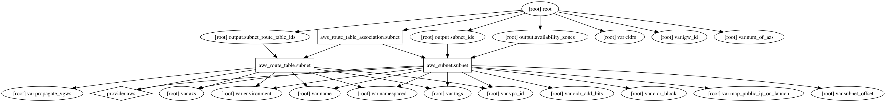

# Subnet in VPC Terraform Module
========================================

A Terraform module to create subnets in a AWS VPC

Usage:
--------

     module "subnet" {
       source       = "../tf_subnet"

       name         = "production-public"
       environment  = "dev"
       cidrs        = ["10.2.1.0/24", "10.2.2.0/24", "10.2.3.0/24"]
       azs          = ["eu-west-1a", "eu-west-1b", "eu-west-1c"]
       vpc_id       = "vpc-12345678"
       igw_id       = "igw-12345678"

       tags {
         "Terraform" = "true"
       }
     }

## Inputs

| Name | Description | Default | Required |
|------|-------------|:-----:|:-----:|
| azs | List of availability zones | `<list>` | no |
| cidr_add_bits | Number of bits to extend CIDR | `0` | no |
| cidr_block | VPC CIDR block to create subnet in | - | yes |
| cidrs | List of VPC CIDR blocks | `<list>` | no |
| environment | Environment (ex: dev, qa, stage, prod) | - | yes |
| igw_id | Internet gateway id | - | yes |
| map_public_ip_on_launch | Should be true or false | `false` | no |
| name | Name | `private` | no |
| namespaced | Namespace all resources (prefixed with the environment)? | `true` | no |
| num_of_azs | Number of availability zones to use | `2` | no |
| propagate_vgws | List of virtual gateways for propagation | - | yes |
| subnet_offset | Offset to add to subnet number | `0` | no |
| tags | A map of tags to add to all resources | `<map>` | no |
| vpc_id | VPC id | - | yes |

## Outputs

| Name | Description |
|------|-------------|
| availability_zones | The list of availability zones of the VPC. |
| subnet_ids | List of subnet ids |
| subnet_route_table_ids | List of route table ids |

### Resource Graph

